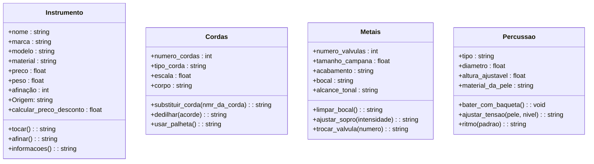

```mermaid
  classDiagram

  class Instrumento{
    +nome : string
    +marca : string
    +modelo : string
    +material : string
    +preco : float
    +peso : float
    +afinação : int
    +Origem: string

    +tocar() : string
    +afinar() : string
    +informacoes() : string
    +calcular_preco_desconto : float
  }

  class Cordas{
    +numero_cordas : int
    +tipo_corda : string
    +escala : float
    +corpo : string

    +substituir_corda(nmr_da_corda) : string
    +dedilhar(acorde) : string
    +usar_palheta() : string
  }

  class Metais{
    +numero_valvulas : int
    +tamanho_campana : float
    +acabamento : string
    +bocal : string
    +alcance_tonal : string

    +limpar_bocal() : string
    +ajustar_sopro(intensidade) : string
    +trocar_valvula(numero) : string
  }

  class Percussao {
    +tipo : string
    +diametro : float
    +altura_ajustavel : float
    +material_da_pele : string

    +bater_com_baqueta() : void
    +ajustar_tensao(pele, nivel) : string
    +ritmo(padrao) : string
  }

```
