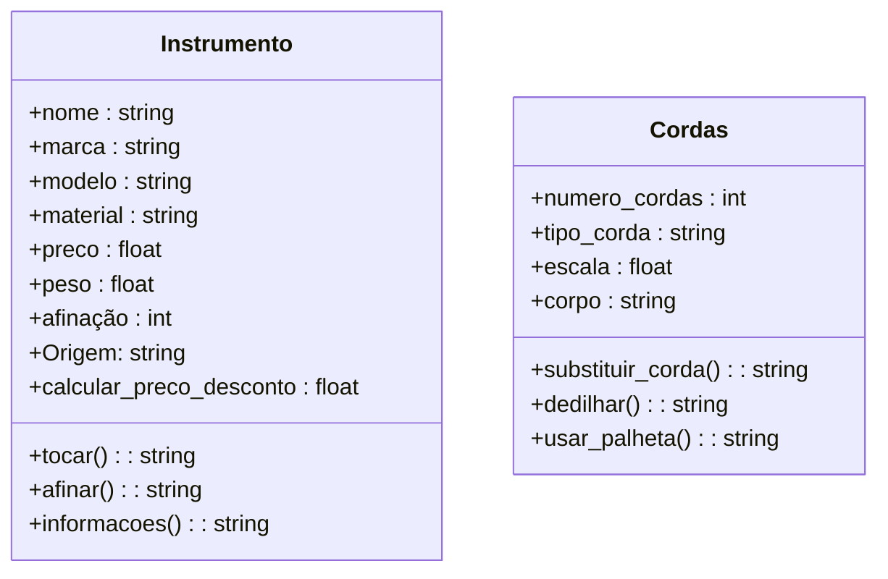

```mermaid
  classDiagram

  class Instrumento{
    +nome : string
    +marca : string
    +modelo : string
    +material : string
    +preco : float
    +peso : float
    +afinação : int
    +Origem: string

    +tocar() : string
    +afinar() : string
    +informacoes() : string
    +calcular_preco_desconto : float
  }

  class Cordas{
    +numero_cordas : int
    +tipo_corda : string
    +escala : float
    +corpo : string

    +substituir_corda() : string
    +dedilhar() : string
    +usar_palheta() : string
  }


```
