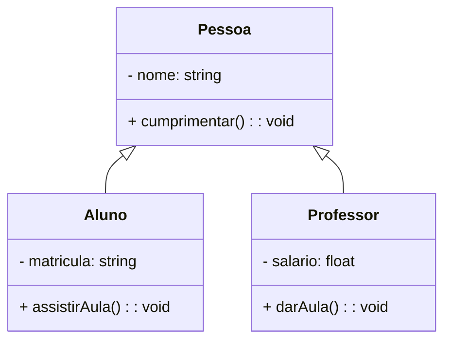

```mermaid
classDiagram
  class Pessoa {
    - nome: string
    + cumprimentar(): void
  }

  class Aluno {
    - matricula: string
    + assistirAula(): void
  }

  class Professor {
    - salario: float
    + darAula(): void
  }

  class Pessoa
  class Aluno
  class Professor

  Pessoa <|-- Aluno
  Pessoa <|-- Professor
```
