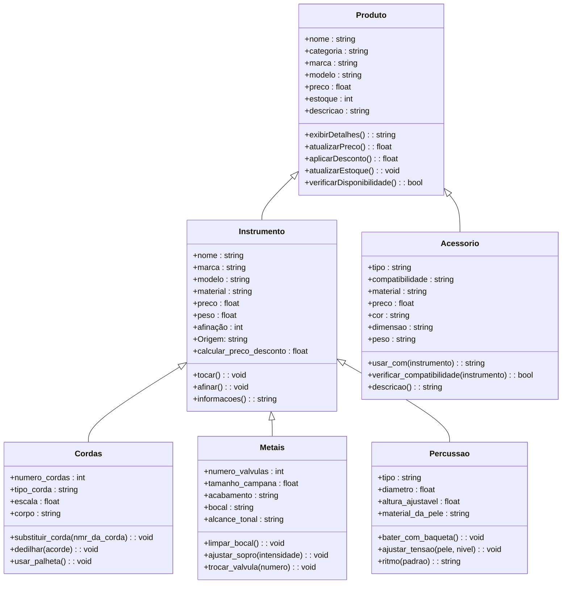

```mermaid
  classDiagram

  class Produto{
    +nome : string
    +categoria : string
    +marca : string
    +modelo : string
    +preco : float
    +estoque : int
    +descricao : string

    +exibirDetalhes() : string
    +atualizarPreco(): float
    +aplicarDesconto() : float
    +atualizarEstoque() : void
    +verificarDisponibilidade() : bool
  }
   

  class Instrumento{
    +nome : string
    +marca : string
    +modelo : string
    +material : string
    +preco : float
    +peso : float
    +afinação : int
    +Origem: string

    +tocar() : void
    +afinar() : void
    +informacoes() : string
    +calcular_preco_desconto : float
  }

  class Cordas{
    +numero_cordas : int
    +tipo_corda : string
    +escala : float
    +corpo : string

    +substituir_corda(nmr_da_corda) : void
    +dedilhar(acorde) : void
    +usar_palheta() : void
  }

  class Metais{
    +numero_valvulas : int
    +tamanho_campana : float
    +acabamento : string
    +bocal : string
    +alcance_tonal : string

    +limpar_bocal() : void
    +ajustar_sopro(intensidade) : void
    +trocar_valvula(numero) : void
  }

  class Percussao {
    +tipo : string
    +diametro : float
    +altura_ajustavel : float
    +material_da_pele : string

    +bater_com_baqueta() : void
    +ajustar_tensao(pele, nivel) : void
    +ritmo(padrao) : string
  }

  class Acessorio {
    +tipo : string
    +compatibilidade : string
    +material : string
    +preco : float
    +cor : string
    +dimensao : string
    +peso : string

    +usar_com(instrumento) : string
    +verificar_compatibilidade(instrumento) : bool
    +descricao() : string
  }


Produto <|-- Instrumento
Produto <|-- Acessorio

Instrumento <|-- Cordas
Instrumento <|-- Metais
Instrumento <|-- Percussao

```
